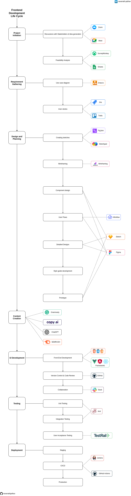

# Frontend Development Life Cycle

Welcome to the Frontend Development Life Cycle repository! This comprehensive guide outlines the various stages and essential tools involved in the frontend development process. Whether you're a seasoned developer or just starting, understanding this structured workflow can significantly enhance your frontend project's success.

## Give a Star ⭐

If you liked this project or found it helpful then please give it a star.
Thanks.

## Diagram

## Download

Get a [PDF version](./Frontend_Development_Life_Cycle.pdf).

## Project Initiation

The journey begins here, with the critical steps of project initiation:

- **Discussions with Stakeholders & Idea Generation:** Kickstart your project with meaningful discussions with stakeholders. Leverage communication tools like Zoom or Google Meet to bring all key players together. Brainstorm ideas, gather insights, and ensure alignment with project goals.

- **Feasibility Analysis:** Before diving in, assess the feasibility of your project. Use survey tools such as SurveyMonkey or Google Sheets to gather initial data, conduct market research, and understand potential challenges and opportunities.

## Requirement Gathering

Accurate requirement gathering is fundamental to project success:

- **Use Case Diagram:** Visualize project requirements with precision using use case diagrams created through intuitive tools like Draw.io. This step ensures that everyone involved has a clear understanding of the project's scope and functionality.

- **User Stories:** Manage user requirements efficiently using robust project management tools like Jira or Trello. Create, organize, and prioritize user stories to guide your development process effectively.

## Design and Planning

Design and planning lay the foundation for your project's aesthetics and functionality:

- **Creating Sketches:** Begin the design journey by sketching out initial concepts and ideas. Tools like Figjam or Sketchpad provide a canvas for creativity and innovation.

- **Wireframing:** Develop wireframes that map out your project's layout and structure. Platforms like Justinmind's wireframing tool help you create clear blueprints for your frontend.

- **Component Design:** Dive into the details by designing individual project components. Software like Sketch or Figma empowers you to create visually appealing and functional elements.

- **Usability, Navigation, User Flows, and Task Flows:** Plan user interactions, optimize navigation, and define user and task flows. Tools like Figma or Wireflow help you create intuitive and efficient user experiences.

- **Detailed Designs:** Elevate your project with detailed design mockups, ensuring that every pixel aligns with your vision. Utilize Figma or Sketch to capture the full aesthetic potential of your frontend.

- **Style Guide Development:** Maintain design consistency across your project with a style guide. Ensure that fonts, colors, and design elements harmonize seamlessly.

- **Prototype:** Transform static designs into interactive prototypes. These prototypes, built using Figma or Sketch, allow stakeholders to experience your frontend's functionality and provide valuable feedback.

## Content Creation

Compelling content enhances user engagement:

- Leverage content creation tools such as Grammarly, copy.ai, ChatGPT, and SEMrush to craft captivating and SEO-friendly content that resonates with your audience.

## UI Development

The heart of your project lies in its frontend development:

- **Front-End Development:** Breathe life into your designs using HTML, CSS, JavaScript, and frontend frameworks like Angular, React, or Vue.js. Create dynamic and responsive user interfaces that captivate your audience.

- **Version Control & Code Review:** Collaboration is key. Harness the power of Git to manage your codebase efficiently. Collaborate seamlessly with your team and maintain code quality through code reviews.

- **Collaboration:** Facilitate teamwork and communication among your development team through collaboration platforms like Slack. Streamline discussions, share insights, and foster a collaborative environment.

## Testing

Rigorous testing ensures a flawless frontend:

- **Unit Testing:** Guarantee code reliability by implementing comprehensive unit tests. Tools like Jest provide a robust framework for running tests and catching issues early in the development cycle.

- **Integration Testing:** Verify the seamless integration of project components through integration tests, again using tools like Jest. Ensure that various parts of your frontend work harmoniously together.

- **User Acceptance Testing:** Conduct user acceptance testing using dedicated platforms like TestRail. This crucial step validates that your project aligns with user expectations and functions as intended.

## Deployment

Prepare your project for the world:

- **Staging:** Deploy your project to a staging environment, replicating the production environment as closely as possible. This ensures thorough testing and quality assurance before going live.

- **CI/CD:** Implement Continuous Integration and Continuous Deployment (CI/CD) pipelines using powerful automation tools like Jenkins or GitHub Actions. Automate testing and deployment processes for an efficient development lifecycle.

- **Production:** Finally, release your project into the production environment, making it accessible to your target audience. Celebrate your successful frontend deployment!

## Conclusion

Frontend Development Life Cycle provides a robust framework for creating web applications that meet user needs and industry standards. By following the stages of project initiation, requirement gathering, design, development, testing, and deployment, you can ensure a systematic and efficient development process. Leveraging collaboration tools, design principles, and testing methodologies enhances the quality and user-friendliness of your frontends.

## Share & Care

If you think this project is helpful share it on [Twitter](https://twitter.com/intent/tweet?url=https://github.com/navanathjadhav/Frontend-Development-Life-Cycle).

## Contribute

Feel free to customize and expand upon this comprehensive guide to match your specific frontend development process and toolset. Remember, a well-structured frontend development lifecycle is the key to building outstanding web applications that delight users and achieve your project's goals.

Submit a PR.
